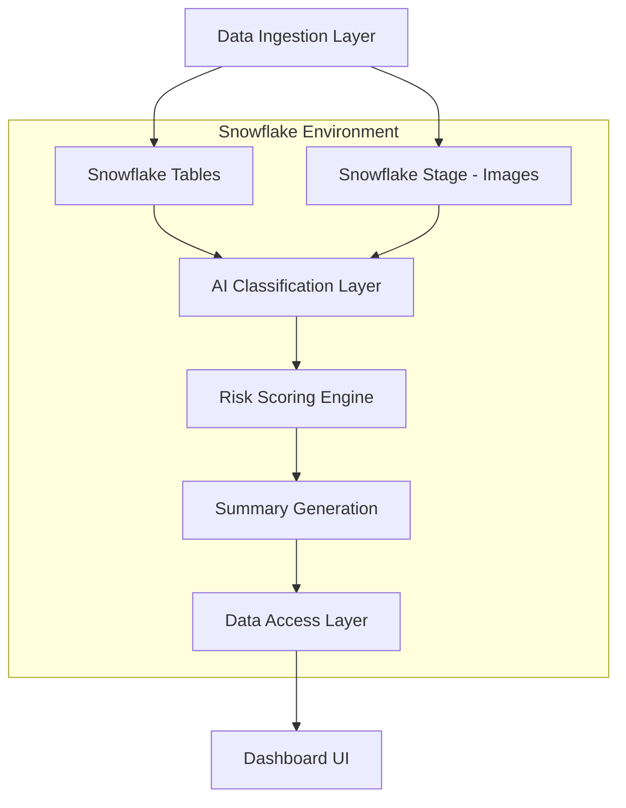

# Design Document

## Overview

The AI-Assisted Home Inspection Workspace is a Snowflake-native application that leverages Cortex AI to automatically analyze home inspection data. The system ingests property information, room details, text notes, and images, then applies machine learning to classify defects, compute risk scores, and generate human-readable summaries. The architecture follows a data pipeline pattern: ingestion → AI classification → aggregation → presentation, with all processing occurring within Snowflake for security and governance.

The system serves two primary user groups: inspectors who upload inspection data, and stakeholders (buyers, tenants, regulators) who review analysis results through an interactive dashboard.

## Architecture

### High-Level Architecture



### Component Layers

1. **Data Ingestion Layer**: Handles uploads of property metadata, room information, text findings, and image files
2. **Storage Layer**: Snowflake tables for structured data and Snowflake Stage for image files
3. **AI Classification Layer**: Applies Cortex AI functions (CLASSIFY_TEXT, AI_CLASSIFY) to tag defects
4. **Risk Scoring Engine**: Aggregates defect tags and computes numerical risk scores
5. **Summary Generation**: Uses Cortex AI SUMMARIZE to create plain-language reports
6. **Data Access Layer**: SQL queries and views that serve processed data to the UI
7. **Dashboard UI**: Web interface (Streamlit or similar) for viewing and filtering results

### Technology Stack

- **Database**: Snowflake (tables, stages, views)
- **AI/ML**: Snowflake Cortex AI (CLASSIFY_TEXT, AI_CLASSIFY, SUMMARIZE)
- **Compute**: Snowflake SQL and Snowpark Python (optional for custom models)
- **UI Framework**: Streamlit (recommended) or web application
- **Export**: PDF generation library, CSV export via Snowflake

## Components and Interfaces

### 1. Data Ingestion Component

**Responsibilities:**
- Accept property, room, and finding data from inspectors
- Validate input data formats and required fields
- Store structured data in Snowflake tables
- Upload images to Snowflake Stage with proper naming conventions

**Interfaces:**
- `ingest_property(property_data: dict) -> property_id: str`
- `ingest_room(room_data: dict, property_id: str) -> room_id: str`
- `ingest_text_finding(note: str, room_id: str) -> finding_id: str`
- `ingest_image_finding(image_file: bytes, filename: str, room_id: str) -> finding_id: str`

### 2. AI Classification Component

**Responsibilities:**
- Apply Cortex AI text classification to text findings
- Apply Cortex AI image classification to image findings
- Handle classification errors and log failures
- Store classification results with confidence scores

**Interfaces:**
- `classify_text_finding(finding_id: str, note_text: str) -> defect_tags: list[str]`
- `classify_image_finding(finding_id: str, image_path: str) -> defect_tags: list[str]`
- `batch_classify_findings(finding_ids: list[str]) -> results: dict`

**SQL Implementation:**
```sql
-- Text classification
SELECT 
    finding_id,
    SNOWFLAKE.CORTEX.CLASSIFY_TEXT(
        note_text, 
        ['damp wall', 'exposed wiring', 'crack', 'mold', 'water leak', 'none']
    ) AS defect_tag
FROM text_findings;

-- Image classification
SELECT 
    finding_id,
    AI_CLASSIFY(
        TO_FILE('@inspections', image_filename),
        ['crack', 'water leak', 'mold', 'electrical wiring', 'none']
    ) AS defect_tags
FROM image_findings;
```

### 3. Risk Scoring Component

**Responsibilities:**
- Aggregate defect tags by room and property
- Apply severity weights to compute numerical scores
- Categorize scores into Low/Medium/High risk levels
- Store computed scores for quick retrieval

**Interfaces:**
- `compute_room_risk(room_id: str) -> risk_score: int`
- `compute_property_risk(property_id: str) -> risk_score: int, risk_category: str`
- `get_defect_counts(entity_id: str, entity_type: str) -> defect_counts: dict`

**Severity Weights:**
- Exposed wiring: 3
- Damp wall: 3
- Mold: 3
- Water leak: 2
- Crack: 2
- None: 0

**Risk Categories:**
- Low: score < 5
- Medium: 5 ≤ score < 10
- High: score ≥ 10

### 4. Summary Generation Component

**Responsibilities:**
- Aggregate defect information into structured text
- Apply Cortex AI SUMMARIZE to generate natural language
- Format summaries for readability
- Handle edge cases (no defects, single defect type)

**Interfaces:**
- `generate_property_summary(property_id: str) -> summary_text: str`
- `format_defect_description(defect_counts: dict) -> description: str`

**SQL Implementation:**
```sql
SELECT 
    property_id,
    SNOWFLAKE.CORTEX.SUMMARIZE(
        'Property inspection found: ' || 
        damp_count || ' rooms with damp walls, ' ||
        wiring_count || ' rooms with exposed wiring, ' ||
        crack_count || ' rooms with cracks. ' ||
        'Overall risk: ' || risk_category
    ) AS summary_text
FROM property_risk_scores;
```

### 5. Dashboard Component

**Responsibilities:**
- Display property list with risk indicators
- Provide detail views for properties and rooms
- Enable filtering by risk level and defect type
- Support search functionality
- Trigger export operations

**Interfaces:**
- `get_property_list(filters: dict) -> properties: list[dict]`
- `get_property_details(property_id: str) -> property_data: dict`
- `get_room_details(room_id: str) -> room_data: dict`
- `export_property_report(property_id: str, format: str) -> file_path: str`

### 6. Export Component

**Responsibilities:**
- Generate PDF reports with images and annotations
- Export CSV data with all relevant fields
- Format data for external consumption
- Provide download mechanisms

**Interfaces:**
- `export_pdf(property_id: str) -> pdf_bytes: bytes`
- `export_csv(property_ids: list[str]) -> csv_bytes: bytes`

## Data Models

### Properties Table
```sql
CREATE TABLE properties (
    property_id VARCHAR PRIMARY KEY,
    location VARCHAR NOT NULL,
    inspection_date DATE NOT NULL,
    risk_score INTEGER,
    risk_category VARCHAR,
    summary_text TEXT,
    created_at TIMESTAMP DEFAULT CURRENT_TIMESTAMP,
    updated_at TIMESTAMP DEFAULT CURRENT_TIMESTAMP
);
```

### Rooms Table
```sql
CREATE TABLE rooms (
    room_id VARCHAR PRIMARY KEY,
    property_id VARCHAR NOT NULL,
    room_type VARCHAR NOT NULL,
    room_location VARCHAR,
    risk_score INTEGER,
    created_at TIMESTAMP DEFAULT CURRENT_TIMESTAMP,
    FOREIGN KEY (property_id) REFERENCES properties(property_id)
);
```

### Findings Table
```sql
CREATE TABLE findings (
    finding_id VARCHAR PRIMARY KEY,
    room_id VARCHAR NOT NULL,
    finding_type VARCHAR NOT NULL, -- 'text' or 'image'
    note_text TEXT,
    image_filename VARCHAR,
    image_stage_path VARCHAR,
    processing_status VARCHAR DEFAULT 'pending', -- 'pending', 'processed', 'failed'
    created_at TIMESTAMP DEFAULT CURRENT_TIMESTAMP,
    FOREIGN KEY (room_id) REFERENCES rooms(room_id)
);
```

### Defect Tags Table
```sql
CREATE TABLE defect_tags (
    tag_id VARCHAR PRIMARY KEY,
    finding_id VARCHAR NOT NULL,
    defect_category VARCHAR NOT NULL,
    confidence_score FLOAT,
    severity_weight INTEGER,
    classified_at TIMESTAMP DEFAULT CURRENT_TIMESTAMP,
    FOREIGN KEY (finding_id) REFERENCES findings(finding_id)
);
```

### Classification History Table
```sql
CREATE TABLE classification_history (
    history_id VARCHAR PRIMARY KEY,
    finding_id VARCHAR NOT NULL,
    defect_category VARCHAR NOT NULL,
    confidence_score FLOAT,
    classification_method VARCHAR, -- 'text_ai', 'image_ai', 'manual'
    classified_at TIMESTAMP DEFAULT CURRENT_TIMESTAMP,
    FOREIGN KEY (finding_id) REFERENCES findings(finding_id)
);
```

### Snowflake Stage
```sql
CREATE STAGE inspections
    DIRECTORY = (ENABLE = TRUE)
    FILE_FORMAT = (TYPE = 'BINARY');
```

### Materialized Views for Performance

```sql
-- Aggregated defect counts per room
CREATE MATERIALIZED VIEW room_defect_summary AS
SELECT 
    r.room_id,
    r.property_id,
    COUNT(DISTINCT f.finding_id) AS total_findings,
    COUNT(CASE WHEN dt.defect_category = 'damp wall' THEN 1 END) AS damp_count,
    COUNT(CASE WHEN dt.defect_category = 'exposed wiring' THEN 1 END) AS wiring_count,
    COUNT(CASE WHEN dt.defect_category = 'crack' THEN 1 END) AS crack_count,
    COUNT(CASE WHEN dt.defect_category = 'mold' THEN 1 END) AS mold_count,
    COUNT(CASE WHEN dt.defect_category = 'water leak' THEN 1 END) AS leak_count,
    SUM(dt.severity_weight) AS room_risk_score
FROM rooms r
LEFT JOIN findings f ON r.room_id = f.room_id
LEFT JOIN defect_tags dt ON f.finding_id = dt.finding_id
GROUP BY r.room_id, r.property_id;

-- Aggregated defect counts per property
CREATE MATERIALIZED VIEW property_defect_summary AS
SELECT 
    p.property_id,
    COUNT(DISTINCT r.room_id) AS total_rooms,
    COUNT(DISTINCT f.finding_id) AS total_findings,
    SUM(CASE WHEN dt.defect_category = 'damp wall' THEN 1 ELSE 0 END) AS damp_count,
    SUM(CASE WHEN dt.defect_category = 'exposed wiring' THEN 1 ELSE 0 END) AS wiring_count,
    SUM(CASE WHEN dt.defect_category = 'crack' THEN 1 ELSE 0 END) AS crack_count,
    SUM(CASE WHEN dt.defect_category = 'mold' THEN 1 ELSE 0 END) AS mold_count,
    SUM(CASE WHEN dt.defect_category = 'water leak' THEN 1 ELSE 0 END) AS leak_count,
    SUM(dt.severity_weight) AS property_risk_score,
    CASE 
        WHEN SUM(dt.severity_weight) >= 10 THEN 'High'
        WHEN SUM(dt.severity_weight) >= 5 THEN 'Medium'
        ELSE 'Low'
    END AS risk_category
FROM properties p
LEFT JOIN rooms r ON p.property_id = r.property_id
LEFT JOIN findings f ON r.room_id = f.room_id
LEFT JOIN defect_tags dt ON f.finding_id = dt.finding_id
GROUP BY p.property_id;
```


## Correctness Properties

*A property is a characteristic or behavior that should hold true across all valid executions of a system-essentially, a formal statement about what the system should do. Properties serve as the bridge between human-readable specifications and machine-verifiable correctness guarantees.*

### Property 1: Data storage round-trip preservation
*For any* property metadata (identifier, location, inspection date), storing it in the database and then retrieving it should return equivalent values for all fields.
**Validates: Requirements 1.1**

### Property 2: Room-property linkage integrity
*For any* room created with a property association, querying the room should return the correct property_id linkage.
**Validates: Requirements 1.2**

### Property 3: Finding storage and retrieval
*For any* text or image finding stored with a room association, retrieving the finding should return the correct room_id and finding content.
**Validates: Requirements 1.3, 1.4**

### Property 4: Text classification produces valid categories
*For any* text finding that is classified, the resulting defect tag must be one of: "damp wall", "exposed wiring", "crack", "mold", "water leak", or "none".
**Validates: Requirements 2.1, 2.2**

### Property 5: Classification results are persisted
*For any* finding that undergoes classification, querying the defect_tags table should return the classification result associated with that finding.
**Validates: Requirements 2.3, 3.3**

### Property 6: Image classification produces valid categories
*For any* image finding that is classified, all resulting defect tags must be from the set: "crack", "water leak", "mold", "electrical wiring", or "none".
**Validates: Requirements 3.1, 3.2**

### Property 7: Multiple tags are preserved
*For any* image finding with multiple detected defects, all detected tags should be stored and retrievable from the database.
**Validates: Requirements 3.4**

### Property 8: Severity weights are correctly applied
*For any* defect tag, the severity weight used in calculations must match the specification: "exposed wiring"=3, "damp wall"=3, "mold"=3, "water leak"=2, "crack"=2, "none"=0.
**Validates: Requirements 4.2**

### Property 9: Room risk score calculation
*For any* room with a known set of defect tags, the computed risk score should equal the sum of the severity weights for those tags.
**Validates: Requirements 4.1, 4.3**

### Property 10: Property risk score aggregation
*For any* property with rooms that have known risk scores, the property risk score should equal the sum of all room risk scores.
**Validates: Requirements 4.4**

### Property 11: Risk categorization correctness
*For any* property with a computed risk score, the risk category should be "Low" if score < 5, "Medium" if 5 ≤ score < 10, or "High" if score ≥ 10.
**Validates: Requirements 4.5**

### Property 12: Summary generation completeness
*For any* property with defects, the generated summary should contain the risk category, a count of affected rooms, and at least one defect type.
**Validates: Requirements 5.1, 5.2**

### Property 13: High-severity defects appear in summaries
*For any* property with both high-severity (weight=3) and low-severity (weight≤2) defects, the summary should mention at least one high-severity defect type.
**Validates: Requirements 5.5**

### Property 14: Dashboard displays all properties
*For any* set of properties in the database, the dashboard property list should include all of them when no filters are applied.
**Validates: Requirements 6.1**

### Property 15: Property list contains required fields
*For any* property displayed in the list, the rendered output should include property identifier, location, inspection date, risk category, and risk score.
**Validates: Requirements 6.2**

### Property 16: Detail view shows complete data
*For any* property selected for detail view, the displayed information should include all associated rooms, findings, and defect tags.
**Validates: Requirements 6.3**

### Property 17: Risk level filtering correctness
*For any* risk category filter applied, all returned properties should have that risk category, and no properties with that category should be excluded.
**Validates: Requirements 7.1**

### Property 18: Defect type filtering correctness
*For any* defect type filter applied, all returned properties should contain at least one finding with that defect tag.
**Validates: Requirements 7.2**

### Property 19: Search term matching
*For any* search term, all returned properties should have that term in their location, identifier, or summary text.
**Validates: Requirements 7.3**

### Property 20: Multiple filter intersection
*For any* combination of filters applied, returned properties should satisfy all filter conditions simultaneously.
**Validates: Requirements 7.4**

### Property 21: Filter clearing restores full list
*For any* dashboard state with filters applied, clearing all filters should result in displaying the same set of properties as the initial unfiltered state.
**Validates: Requirements 7.5**

### Property 22: Export completeness
*For any* property exported, the export document should contain all property details, room information, defect tags, risk scores, and summary text.
**Validates: Requirements 8.1**

### Property 23: Export format support
*For any* export request specifying PDF or CSV format, the system should successfully generate a file in that format.
**Validates: Requirements 8.2**

### Property 24: PDF export includes images and annotations
*For any* property exported as PDF, the document should contain all inspection images with their associated defect tag annotations visible.
**Validates: Requirements 8.3**

### Property 25: CSV export includes all records
*For any* property exported as CSV, the file should contain rows for all properties, rooms, and findings with their classifications.
**Validates: Requirements 8.4**

### Property 26: Classification failure isolation
*For any* batch of findings being classified, if one classification fails, all other findings in the batch should still be processed successfully.
**Validates: Requirements 9.1**

### Property 27: Error messages hide sensitive details
*For any* error encountered during processing, the user-facing error message should not contain database connection strings, API keys, or internal system paths.
**Validates: Requirements 9.5**

### Property 28: Classification metadata is recorded
*For any* defect tag assigned to a finding, the database should contain a timestamp and confidence score for that classification.
**Validates: Requirements 10.1**

### Property 29: Risk calculation traceability
*For any* computed risk score, the system should store which defect tags contributed to the score and their individual weights.
**Validates: Requirements 10.2**

### Property 30: Source data preservation
*For any* generated summary, the original defect counts and room data used to create the summary should remain accessible in the database.
**Validates: Requirements 10.3**

### Property 31: Referential integrity maintenance
*For any* database operation (insert, update, delete), all foreign key relationships between properties, rooms, and findings should remain valid.
**Validates: Requirements 10.4**

### Property 32: Classification history preservation
*For any* finding that is reclassified, the previous classification should be preserved in the classification_history table with its original timestamp.
**Validates: Requirements 10.5**

## Error Handling

### Classification Errors
- **Text Classification Failure**: Log error with finding_id, error message, and timestamp. Mark finding as 'failed' in processing_status. Continue processing other findings.
- **Image Classification Failure**: Log error with finding_id, image path, and error details. Mark finding as 'failed'. Attempt to classify other images.
- **Missing Image File**: Record error in findings table. Set processing_status to 'failed'. Notify user that image is inaccessible.

### Data Validation Errors
- **Invalid Property Data**: Reject upload with clear error message indicating which required fields are missing or invalid.
- **Orphaned Room**: Prevent room creation if property_id doesn't exist. Return foreign key constraint error.
- **Invalid Defect Category**: Log warning if AI returns unexpected category. Map to 'none' as fallback.

### Computation Errors
- **Risk Score Calculation**: If defect tags are missing severity weights, use weight=0 and log warning. Continue calculation.
- **Summary Generation Failure**: If Cortex SUMMARIZE fails, generate basic summary using template: "Risk: {category}. Found {count} defects including {top_defect}."
- **Aggregation Errors**: If materialized views are stale, refresh them. If refresh fails, query base tables directly.

### UI/Export Errors
- **Dashboard Load Failure**: Display error message to user. Provide retry button. Log error details for debugging.
- **Export Generation Failure**: Notify user that export failed. Offer alternative format. Log error with property_id and format.
- **Filter Application Error**: Reset filters to default state. Display warning to user. Log filter parameters that caused error.

### Error Logging Strategy
All errors should be logged to a centralized error_log table:
```sql
CREATE TABLE error_log (
    error_id VARCHAR PRIMARY KEY,
    error_type VARCHAR NOT NULL,
    error_message TEXT NOT NULL,
    entity_type VARCHAR, -- 'property', 'room', 'finding'
    entity_id VARCHAR,
    stack_trace TEXT,
    occurred_at TIMESTAMP DEFAULT CURRENT_TIMESTAMP
);
```

## Testing Strategy

### Unit Testing

Unit tests will verify specific examples and edge cases for individual components:

**Data Ingestion Tests:**
- Test property creation with valid data
- Test property creation with missing required fields (should fail)
- Test room creation with valid property_id
- Test room creation with non-existent property_id (should fail)
- Test finding creation with text notes
- Test finding creation with image files
- Test handling of empty text notes
- Test handling of corrupted image files

**Risk Scoring Tests:**
- Test severity weight lookup for each defect category
- Test room risk calculation with single defect
- Test room risk calculation with multiple defects
- Test property risk calculation with single room
- Test property risk calculation with multiple rooms
- Test risk categorization at boundary values (scores 4, 5, 9, 10)
- Test risk calculation with no defects (should be 0)

**Summary Generation Tests:**
- Test summary generation for property with no defects
- Test summary generation for property with single defect type
- Test summary generation for property with multiple defect types
- Test summary includes risk category
- Test summary includes room counts

**Filtering Tests:**
- Test risk level filter with each category (Low, Medium, High)
- Test defect type filter with each category
- Test search with exact matches
- Test search with partial matches
- Test combining risk and defect filters
- Test clearing filters

**Export Tests:**
- Test PDF export with images
- Test CSV export with all fields
- Test export with no data (empty property)
- Test export with large datasets

### Property-Based Testing

Property-based tests will verify universal properties across many randomly generated inputs using a PBT library appropriate for the implementation language (e.g., Hypothesis for Python, fast-check for JavaScript/TypeScript, QuickCheck for Haskell).

**Configuration:**
- Each property test should run a minimum of 100 iterations
- Each test must include a comment tag referencing the design document property
- Tag format: `**Feature: ai-home-inspection, Property {number}: {property_text}**`

**Test Generators:**

Smart generators will be created to produce valid test data:

```python
# Example generator structure (Python/Hypothesis)
@composite
def property_data(draw):
    return {
        'property_id': draw(st.uuids()),
        'location': draw(st.text(min_size=1, max_size=100)),
        'inspection_date': draw(st.dates())
    }

@composite
def defect_tag(draw):
    return draw(st.sampled_from([
        'damp wall', 'exposed wiring', 'crack', 
        'mold', 'water leak', 'none'
    ]))

@composite
def room_with_defects(draw):
    room_id = draw(st.uuids())
    num_defects = draw(st.integers(min_value=0, max_value=10))
    defects = draw(st.lists(defect_tag(), min_size=num_defects, max_size=num_defects))
    return {'room_id': room_id, 'defects': defects}
```

**Property Test Coverage:**

Each correctness property will be implemented as a property-based test:

- Properties 1-3: Round-trip tests for data storage
- Properties 4-7: Classification output validation
- Properties 8-11: Risk scoring and categorization
- Properties 12-13: Summary content validation
- Properties 14-21: Dashboard and filtering behavior
- Properties 22-25: Export completeness
- Properties 26-27: Error handling
- Properties 28-32: Audit and traceability

### Integration Testing

Integration tests will verify end-to-end workflows:

- Complete inspection workflow: upload → classify → score → summarize → display
- Multi-property dashboard with filtering and search
- Export generation for properties with various defect combinations
- Error recovery: classification failure → retry → success

### Performance Testing

Performance tests will ensure the system scales appropriately:

- Batch classification of 1000+ findings
- Dashboard load time with 100+ properties
- Export generation for large properties (50+ rooms, 500+ findings)
- Materialized view refresh time

### Testing Tools

- **Unit Testing**: pytest (Python) or Jest (JavaScript/TypeScript)
- **Property-Based Testing**: Hypothesis (Python) or fast-check (JavaScript/TypeScript)
- **Integration Testing**: pytest with Snowflake connector
- **Performance Testing**: pytest-benchmark or custom timing utilities
- **Mocking**: unittest.mock (Python) or Jest mocks (JavaScript) - use sparingly, prefer real Snowflake test database

## Implementation Notes

### Snowflake-Specific Considerations

1. **Cortex AI Availability**: Ensure Snowflake account has Cortex AI features enabled. Check region availability.

2. **Stage Configuration**: Create stage with appropriate permissions. Consider using external stages (S3, Azure Blob) for large image volumes.

3. **Compute Resources**: Use appropriate warehouse sizes for AI workloads. Image classification may require larger warehouses.

4. **Cost Management**: Cortex AI functions incur costs per call. Implement batch processing to optimize costs.

5. **Materialized View Refresh**: Schedule automatic refresh of materialized views or use event-driven refresh triggers.

### Security Considerations

1. **Data Access Control**: Implement role-based access control (RBAC) in Snowflake. Inspectors should have write access, stakeholders read-only.

2. **Image Storage**: Ensure stage has appropriate access controls. Consider encryption for sensitive inspection images.

3. **API Keys**: If using external services, store API keys in Snowflake secrets or external secret management.

4. **Audit Logging**: Enable Snowflake query history and access logs for compliance.

### Scalability Considerations

1. **Batch Processing**: Process classifications in batches rather than one-by-one to improve throughput.

2. **Parallel Processing**: Use Snowflake's parallel execution for independent classification tasks.

3. **Caching**: Cache frequently accessed property summaries and risk scores in materialized views.

4. **Archival**: Implement data retention policies to archive old inspections and maintain performance.

### UI Implementation Options

**Option 1: Streamlit (Recommended)**
- Native Snowflake integration
- Rapid development
- Built-in components for data visualization
- Easy deployment via Snowflake

**Option 2: Custom Web Application**
- More flexibility in UI/UX design
- Can use modern frameworks (React, Vue, Angular)
- Requires separate hosting and Snowflake connector setup
- Better for complex custom workflows

### Future Enhancements

1. **Custom ML Models**: Train domain-specific defect detection models using Snowpark ML for higher accuracy.

2. **Automated Recommendations**: Generate repair recommendations based on detected defects.

3. **Trend Analysis**: Track defect patterns across properties and time periods.

4. **Mobile App**: Develop mobile application for on-site inspection data capture.

5. **Integration with External Systems**: Connect to property management systems, insurance platforms, or regulatory databases.

6. **Real-time Notifications**: Alert stakeholders when high-risk properties are identified.

7. **Comparative Analysis**: Compare properties against regional or national safety benchmarks.
